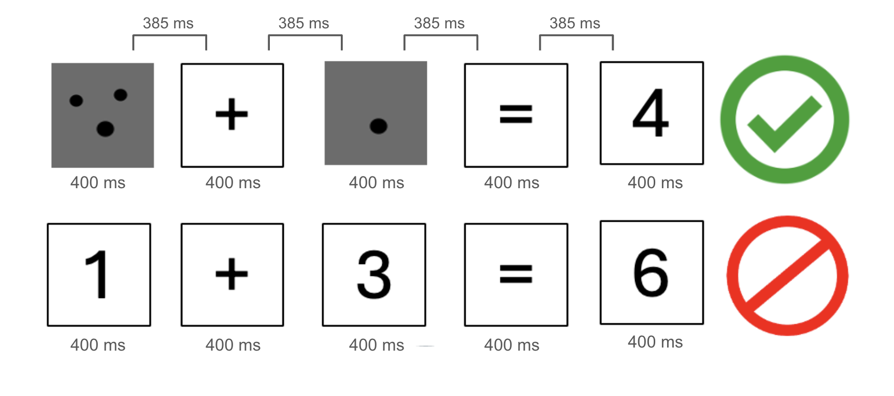

# eeg-dot-digit-analysis

Analysis repo for running classification analysis on the SENSI Egyptian Escape Room dataset.
Preprocessing and analysis scripts are organized in three folders: `bash`, `matlab`, and `python`. 

To reproduce the analyses, you will first need to download the data from the Stanford Data
Repository[LINK HERE]. You can download the raw data or use the preprocessed data to run the
classification analyses. If you choose to use the preprocessed data, you can skip to the `Classification` section. 

## Paradigm Overview

In this paradigm, participants performed an arithmetic verification task where they indicated whether the proposed solution to a
problem was true or false. Each problem constituted one trial, which consisted of 5 images: two operands, a plus sign, an equals sign, and the proposed solution (see image below for overview). The operands ranged from 1 to 5 and were either represented as dots or Arabic numerals. The proposed solutions ranged from 1-9 and were always in the form of Arabic numerals. Participants completed 4 blocks of 40 trials, for a total of 160 trials (or 800 images). 

## Preprocessing

### Data cleaning

The data are cleaned using the SENSI short epoch preprocessing pipeline. The details for using this pipeline can be found [LINK]. In the folder `/bash/preproc/configs`, there are a series of `.m` files that configure the preprocessing pipeline for each participant. 
The paths to these files are listed in the file `/bash/preproc/configs.txt`, which you will have to update to reflect your directory structure. Once you have updated these paths, you are ready to run the preprocessing pipeline. 

To run locally, you will have to edit the `/matlab/preproc/runCleaning.m` file to specify the Matlab paths on your computer and then the function for each participant. 

To run on a HPC (preferred method), simply update `/matlab/preproc/runCleaning.m` to point to the Matlab code on your compute cluster and then submit `/bash/preproc/submit_clean_data_job.sh`. This will submit a job array and run the cleaning script for each participant as an individual slurm job to allow for preprocessing in parallel. 

### Classifcation Setup

Because the EEG data and the trial information are stored in separate files, we need to combine these data before running our analyses. This is done using the `/matlab/preproc/setup_classifcation_data_sherlock.m` script, which can be run locally or on an HPC. To run on the cloud, submit the `/bash/preproc/submit_setup_classification_data.sh` script as a slurm job. As with the previous scripts, you will have to update the `/matlab/preproc/setup_classifcation_data_sherlock.m` to reflect the various data and code paths for your compute environment. 

One note about this step, because not all participants completed the entire experiment, we have to tell `/matlab/preproc/setup_classifcation_data_sherlock.m` how many blocks each participant completed. This is done with the file `/bash/preproc/eni_list.json`, which has the structure `{"subjectID": "ENI_XXX", "blocks": [1,2,3,4]},`, where `subjectID` is the participant ID and blocks is a list of which blocks the participant completed. 

## Classification Analysis

This repository is set up with example scripts for running EEG classification in both Matlab and Python. Matlab classification code relies exclusively on the `MatClassRSA` toolbox while the Python classifcation code makes use of the `scikit-learn` and `MNE-Python` libraries. Although the classification code can be run locally, because the classifications happen within participant and statistical significance is determined through permutation tests, it is recommended that you run these scripts as jobs on a slurm-based HPC cluster. 

### Classification Input Data Structure
| Field             | Description              | Size         | Class   |
|------------------|--------------------|--------------|---------|
| X                | Cleaned EEG Data   | 124x150x800  | double  |
| good_epochs      | Good epoch mask.  1=Good; 0=Bad;      | 800x1        | logical |
| labels3          | Trial Format Label   1=Dots; 2=Digits; 3=Math Symbol       | 800x1        | double  |
| labels_numerosity| Numerosity Label       | 800x1        | double  |
| labels_range     | Numerosity Range Label   1=Subitizing (<6); 2=Counting (>=6)     | 800x1        | double  |
| labels_correct   | True/False Label for Trial   1=True; 0=False      | 160x1        | double  |

### Classification in Matlab

As mentioned previously, the Matlab classification relies on the `MatClassRSA` toolbox. The general workflow for running these analyses is to set up a `config.txt` file (see `/bash/classification/config_answer.txt` for an example). This file will consist of a series of calls to `MatClassRSA` functions. These can then be launched individually through a job array, as done in `/bash/classification/submit_classification_pair_jobarray.sh`. This will read the `MatClassRSA` call as an environmental variable and then run this function in Matlab with the `/matlab/classification/runRSA_job.m` script. Before running this, you will have to update `/matlab/classification/runRSA_job.m` to reflect the directory structure of your compute environment. 

### Classification in Python

To run classification analyses in Python, example scripts can be found in `/python/classification`. The file `/python/classification/run_classification.py` trains a series of classifiers to predict a range of categories found in the data including: numerosity, form, correct/incorrect. These scripts call on a series of functions found in `/python/classification/utils/`, which allow the user to specify specific categories and epochs to run classification analysis on. 

The script `/python/classification/mne_classification.py` gives examples of running time resolved classifications with `MNE-Python`. This script calls on fuctions in `/python/classification/utils/mne_utils.py` that enable the user to run time-resolved classificaiton across a range categories found in the data. 

